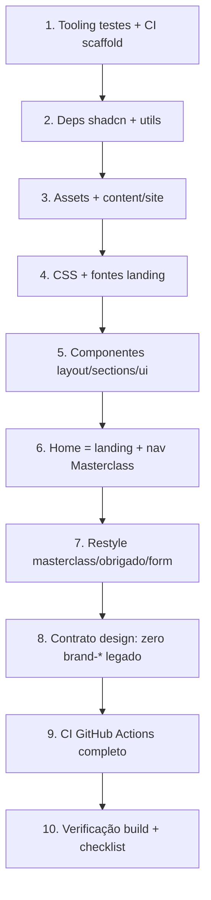

# Plan: Unificar Landing + Masterclass

Referência: [`spec.md`](./spec.md)

## Visão geral

Trazer a landing de `odonto-solution` para `odonto-solution-forms`, substituir o tema cream/terracotta pelo design system gold/shadcn da landing, incluir Masterclass na nav, travar comportamento com TDD (Vitest UI + Playwright) e CI no GitHub Actions. Deploy EasyPanel fica fora deste PR.



## Ordem e paralelismo

| Fase | Sequencial? | Pode paralelizar |
|------|-------------|------------------|
| 1 Tooling TDD | Sim (base) | — |
| 2–3 Deps + assets | Após 1 | 2 e 3 em paralelo |
| 4 CSS/fontes | Após 2–3 | — |
| 5 Componentes landing | Após 4 | sections vs ui em paralelo se desejado |
| 6 Home + nav | Após 5 | — |
| 7 Restyle funil | Após 4 (pode começar com CSS pronto; ideal após 6) | masterclass page / fields / obrigado em fatias TDD |
| 8 Design contract | Após 7 | — |
| 9 CI | Pode iniciar skeleton na fase 1; completar após 7–8 | — |
| 10 Build checklist | Final | — |

**TDD vertical:** cada comportamento da spec vira fatia RED→GREEN antes da próxima. Ex.: primeiro teste E2E “`/` não redireciona” falha → implementar `page.tsx` landing → passa → próximo.

## Componentes

### 1. Tooling de testes (fundação TDD)

- Estender Vitest: environment `jsdom` para `*.test.tsx`; manter `node` para lib.
- Instalar `@testing-library/react`, `@testing-library/jest-dom`, `@testing-library/user-event`, `jsdom`.
- Instalar Playwright (`@playwright/test`), config `playwright.config.ts`, pasta `e2e/`.
- Scripts: `test`, `test:e2e`, `test:e2e:ui` (opcional).
- **Primeiros testes (RED esperado até fases 6–7):**
  - E2E: `/` mostra nome da clínica / não URL final `/masterclass`.
  - E2E: `/masterclass` tem heading Masterclass + campos rotulados.
  - E2E: nav contém link Masterclass.
  - UI: CTA do form entra em loading quando pending (mock da action).
- **Risco:** baixo. Mitigação: E2E usa `webServer: npm run dev` ou `next start` com build; em CI preferir build + start.

### 2. Dependências da landing

- Instalar: `class-variance-authority`, `clsx`, `tailwind-merge`, `lucide-react`, `radix-ui`, `tw-animate-css` (alinhar versões à landing).
- Copiar `components.json` (ajustar paths: CSS em `app/globals.css`, aliases sem `src/`).
- Copiar `lib/utils.ts` (`cn`).
- **Risco:** baixo. Conflito de Next 16.2.9 vs 16.2.10 — manter versão do forms.

### 3. Content + assets

- Copiar `content/site.ts`; adicionar em `nav`: `{ label: "Masterclass", href: "/masterclass" }`.
- Copiar `public/images/**`, `public/logo.png` da landing.
- Manter `public/brand/logo.png` e `logo-dark.png` (decisão locked).
- Copiar `lib/whatsapp.ts`.
- **Risco:** médio — ~12 MB de mídia; garantir `.gitignore` não ignore. Git LFS só se já usado (não forçar).

### 4. CSS + fontes

- Substituir `app/globals.css` pelo da landing (shadcn + gold + `text-label` + `font-display`).
- Trocar `app/fonts.ts` para DM Sans + Playfair Display (remover Cormorant/Manrope).
- Atualizar `app/layout.tsx`: fontes novas + metadata SEO da landing + manter Meta Pixel / Google Tag.
- Remover tokens `--brand-*` e utilitário `.bg-page-atmosphere` (ou deixar órfão só até fase 8 limpar usos).
- **Risco:** médio — masterclass quebra visualmente até fase 7. Aceitável: janela curta na mesma branch.
- **Mitigação:** completar 6–7 na mesma sessão de trabalho; não mergear meio-caminho.

### 5. Componentes da landing

- Copiar `components/layout/*`, `components/sections/*`, `components/ui/*`, `components/icons/*`.
- Ajustar imports `@/` (já compatíveis sem `src/`).
- Header: usar `siteConfig.nav` (já inclui Masterclass após fase 3); garantir Link/`href` funciona para `/masterclass` (não só âncoras `#`).
  - Hoje nav usa `<a href={item.href}>` — ok para `/masterclass` e `#servicos`.
- Opcional: no header, logo da landing (`siteConfig.logo` → `/logo.png`); funil continua com `Logo` light/dark.
- **Risco:** baixo.

### 6. Home = landing

- TDD: E2E home (RED) → implementar `app/page.tsx` como composição Header + sections + Footer + WhatsApp FAB (igual landing) → GREEN.
- Remover `redirect("/masterclass")`.
- **Risco:** baixo.

### 7. Restyle funil (masterclass / form / obrigado)

Fatias TDD sugeridas:

1. **Contrato de tokens na page** — teste de contrato (grep/assert em source ou render) sem `brand-terracotta` / `bg-page-atmosphere` em `app/masterclass/page.tsx` → aplicar mapping da spec.
2. **Fields** — UI test: labels associados; selected state usa `primary`; inputs `min-h-11`.
3. **InterestForm CTA** — UI test loading → trocar botão handmade por `Button` shadcn.
4. **Obrigado** — E2E texto de confirmação + restyle tokens; manter `ConversionEvents`.
5. **Logo** — masterclass/obrigado usam `Logo` com variantes brand.

Não alterar `actions.ts` / schema Prisma / tracking logic.

**Risco:** médio — regressão de submit. Mitigação: testes existentes de schema + UI mock da action; smoke manual submit se DB local disponível.

### 8. Design contract final

- Grep CI/teste: zero matches de `brand-terracotta`, `brand-cream`, `brand-sand`, `brand-clay`, `brand-ink`, `bg-page-atmosphere` em `app/` e `components/` (exceto se algum path de arquivo em `public/brand` — paths de asset ok).
- Remover CSS morto se ainda restar.
- **Risco:** baixo.

### 9. GitHub Actions

Criar `.github/workflows/ci.yml`:

```yaml
# esboço
on: [push, pull_request]
jobs:
  lint-and-unit:
    - npm ci
    - npx prisma generate   # sem migrate
    - npm run lint
    - npm test
  e2e:
    - npm ci
    - npx prisma generate
    - npx playwright install --with-deps
    - npm run build   # pode precisar DATABASE_URL dummy / skip migrate
    - npx playwright test
```

**Atenção build:** script atual `build` = `prisma generate && prisma migrate deploy && next build`. Em CI sem Postgres real, `migrate deploy` falha.

**Mitigação (escolher na implementação, preferir A):**
- **A)** Separar scripts: `build` → `prisma generate && next build`; `build:deploy` → generate + migrate deploy + next build (EasyPanel usa `build:deploy`).
- **B)** CI seta `DATABASE_URL` de serviço Postgres no Actions.

Decisão recomendada no plan: **A** — alinha EasyPanel (migrate no deploy) e CI (só generate + next build). Confirmar na task se EasyPanel hoje chama `npm run build`.

**Risco:** alto se build script mudar sem alinhar EasyPanel. **Ask/verify:** documentar comando de build no EasyPanel na task correspondente.

### 10. Verificação final

- `npm test`, `npm run test:e2e`, `npm run lint`, `npm run build` (ou `build:deploy` local com DB).
- Checklist da spec Success Criteria.
- Sem cutover EasyPanel neste PR.

## Riscos e mitigações

| Risco | Impacto | Mitigação |
|-------|---------|-----------|
| `npm run build` com migrate no CI | CI vermelho | Separar `build` / `build:deploy` |
| Janela com CSS novo e form antigo | UI quebrada na branch | Completar fase 7 antes de PR |
| Assets grandes no git | Clone lento | Aceitar; não recomprimir sem ask |
| Header nav âncora vs rota | Masterclass ok com `/masterclass` | Teste E2E no link |
| Prisma no E2E | Form submit real | E2E não precisa submit completo; UI mock + unit schema |

## Checkpoints de verificação

Após fase 1: scripts de teste existem; pelo menos 1 teste RED documentado.  
Após fase 6: `/` é landing; E2E home GREEN; link Masterclass visível.  
Após fase 7: funil no tema gold; form loading test GREEN; tracking intacto.  
Após fase 9: workflow CI no PR.  
Após fase 10: success criteria da spec.

## Fora deste plan

- Publicar/rebuild no EasyPanel, DNS, desligar app antigo.
- Arquivar repo `odonto-solution`.
- Dark mode / mudança de copy / schema Lead.
