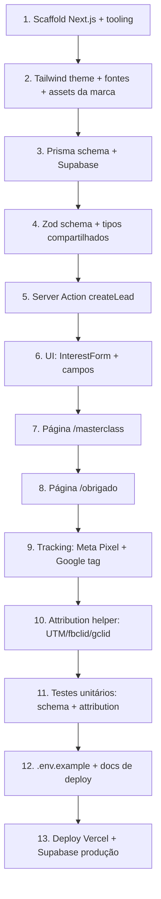

# Plan: Formulário de Lista de Interesse – Masterclass Odonto Solution

Referência: [`docs/spec.md`](./spec.md)

## Visão Geral da Ordem de Implementação

Componentes 1–4 são fundação e sequenciais. 5–8 formam o loop de valor principal (form → persistência → thank you) e devem ser feitos nessa ordem porque a UI depende da Action, que depende do schema. 9–10 (tracking/atribuição) podem ser feitos em paralelo entre si depois que 7–8 existem, mas ambos dependem da estrutura de páginas já estar de pé. 11 (testes) pode começar assim que 4 estiver pronto, em paralelo com 5–8. 12–13 fecham o ciclo.

## Componentes e Dependências

### 1. Scaffold do projeto
- `create-next-app` (TypeScript, App Router, Tailwind, ESLint, sem `src/` — usar `app/` na raiz para manter estrutura da spec).
- Instalar `prisma`, `@prisma/client`, `zod`.
- Configurar `tsconfig.json` paths (`@/*`).
- **Dependências:** nenhuma.
- **Risco:** baixo.

### 2. Tema visual (Tailwind + fontes + assets)
- Copiar assets necessários de `assets/` para `public/brand/` (logo, ícone, pattern — otimizados/renomeados).
- Definir tokens de cor no `globals.css`/Tailwind config (`brand-cream`, `brand-terracotta`, `brand-ink`).
- Configurar `next/font` com par serif + sans.
- **Dependências:** 1.
- **Risco:** baixo. Mitigação: usar fontes do Google Fonts próximas ao estilo do logo (não temos os arquivos de fonte originais).

### 3. Prisma + Supabase
- Escrever `prisma/schema.prisma` (model `Lead` + enums, conforme spec).
- Criar projeto no Supabase (feito pelo usuário — precisa de credenciais).
- Configurar `DATABASE_URL` (pooler, 6543) e `DIRECT_URL` (direto, 5432) localmente via `.env`.
- Rodar `prisma migrate dev` para criar a primeira migration.
- **Dependências:** 1.
- **Risco:** médio — depende de credenciais do Supabase que só o usuário tem. **Checkpoint de verificação humana**: preciso que você crie o projeto Supabase e me passe a connection string (ou eu documento os passos e você cola no `.env` local).

### 4. Zod schema + tipos
- `lib/lead-schema.ts`: schema Zod espelhando os enums do Prisma, com `.superRefine` para condicionais (`professionOther` obrigatório se `profession === 'OTHER'`; `sourceOther` obrigatório se `source === 'OTHER'`).
- Exportar tipos (`LeadInput`) derivados do schema (`z.infer`).
- **Dependências:** 3 (para os enums baterem com o Prisma).
- **Risco:** baixo.

### 5. Server Action `createLead`
- `app/masterclass/actions.ts`: valida com Zod, grava no Prisma, captura `headers()` (user-agent, referer).
- Retorno discriminated union (`ok: true` / `ok: false, fieldErrors`).
- **Dependências:** 3, 4.
- **Risco:** baixo.

### 6. UI: `InterestForm` + campos
- Client component com `useActionState`/`useFormState` (React 19 / Next 15) para chamar a Server Action e exibir erros por campo.
- Subcomponentes: `RadioGroupField`, `TextField`, `TextareaField` — todos client, estilizados com o tema da marca.
- Máscara de WhatsApp (biblioteca leve ou regex manual — decidir na implementação, sem libs pesadas).
- Estados: campos condicionais (Profissão "Outro", Origem "Outro") mostram input extra dinamicamente.
- Honeypot field (input escondido, ignorado no schema se vazio, rejeita silenciosamente se preenchido).
- **Dependências:** 5.
- **Risco:** médio — `useActionState` com Server Actions e client components tem particularidades de Next 15; validar comportamento de redirect pós-submit dentro da própria Action (`redirect('/obrigado')`) vs. no client.

### 7. Página `/masterclass`
- RSC: cabeçalho, texto de introdução (textos exatos do briefing), `<InterestForm />`.
- Metadata (title, description, OG tags básicos) para o link do anúncio.
- **Dependências:** 2, 6.
- **Risco:** baixo.

### 8. Página `/obrigado`
- RSC com a mensagem final exata do briefing.
- Client component filho (`<ConversionEvents />`) que dispara os eventos de pixel no mount — isolado para não forçar toda a página a ser client.
- **Dependências:** 2, 6 (a Action redireciona para aqui).
- **Risco:** baixo.

### 9. Tracking: Meta Pixel + Google tag
- `components/tracking/meta-pixel.tsx` e `google-tag.tsx`: usam `next/script`, renderizam `null` se a env var pública não existir.
- Colocados no `app/layout.tsx` (PageView/page_view globais) — condicionais.
- `components/tracking/conversion-events.tsx`: dispara `fbq('track', 'Lead')` e `gtag('event', 'conversion'/'generate_lead')` em `/obrigado`, também condicional às env vars.
- **Dependências:** 7, 8.
- **Risco:** baixo. Ponto de atenção da spec: **nada pode quebrar se as env vars não existirem** — todos os componentes de tracking devem ter guard clauses.

### 10. Attribution helper (UTM/fbclid/gclid)
- `lib/attribution.ts`: função client-side que lê `window.location.search` na primeira visita, persiste em `sessionStorage` (chave única), e uma função para recuperar esses valores na hora do submit do form.
- Integrado no `InterestForm` (lê atribuição salva e inclui no payload da Server Action).
- **Dependências:** 6.
- **Risco:** baixo-médio — decidir se captura só na primeira página vista (para não perder atribuição se o usuário navegar) ou sempre; optar por "primeira visita ganha" (first-touch) via `sessionStorage`, sobrescrevendo apenas se novos parâmetros de UTM chegarem.

### 11. Testes unitários
- Vitest configurado (`vitest.config.ts`).
- `lib/lead-schema.test.ts`: casos válidos, campos obrigatórios ausentes, condicionais de "Outro".
- `lib/attribution.test.ts`: parsing de querystring com/sem UTM, fbclid, gclid.
- **Dependências:** 4, 10.
- **Risco:** baixo.

### 12. `.env.example` + docs de deploy
- Documentar todas as env vars (`DATABASE_URL`, `DIRECT_URL`, `NEXT_PUBLIC_META_PIXEL_ID`, `NEXT_PUBLIC_GA_MEASUREMENT_ID`, `NEXT_PUBLIC_GOOGLE_ADS_ID`, `NEXT_PUBLIC_GOOGLE_ADS_CONVERSION_LABEL`).
- Passo a passo de deploy na Vercel + build command com `prisma migrate deploy`.
- **Dependências:** 3, 9.
- **Risco:** baixo.

### 13. Deploy
- Conectar repo à Vercel, configurar env vars no dashboard, `prisma migrate deploy` no build (`package.json` → `"build": "prisma generate && prisma migrate deploy && next build"`).
- **Dependências:** todas as anteriores.
- **Risco:** médio — checkpoint humano: precisa das credenciais reais do Supabase e acesso à Vercel para configurar env vars e disparar o deploy.

## Paralelização possível

- **9 (tracking)** e **10 (attribution)** podem ser implementados em paralelo depois de 7–8 estarem prontos (não dependem um do outro).
- **11 (testes)** pode começar tão logo 4 exista, rodando em paralelo com 5–8, mas o teste de `attribution` só fecha depois de 10.
- **2 (tema visual)** pode ser feito em paralelo com **3 (Prisma)**, já que não há dependência entre eles — ambos dependem só de 1.

## Riscos Gerais e Mitigações

| Risco | Mitigação |
|---|---|
| Credenciais do Supabase não disponíveis ainda | Eu deixo o schema e `.env.example` prontos; você cola a connection string quando criar o projeto, e roda a migration local. |
| Free tier do Supabase limita conexões | Uso obrigatório do pooler (`pgbouncer=true`) na `DATABASE_URL`. |
| Pixels quebrando o form se mal configurados | Guard clauses em todo componente de tracking; testado manualmente sem nenhuma env var de pixel setada (critério de sucesso da spec). |
| `useActionState` + client form no Next 15 tendo comportamento inesperado no redirect | Prototipar esse fluxo primeiro (task isolada) antes de construir todos os 12 campos, para validar o padrão antes de escalar. |

## Checkpoints de Verificação Humana

1. **Após Prisma schema (bloco 3):** você precisa criar o projeto Supabase e fornecer a connection string (ou eu documento os passos e você mesmo roda localmente).
2. **Após UI básica (bloco 6–7):** revisão visual rápida antes de eu implementar os 12 campos completos, para validar o tema.
3. **Antes do deploy (bloco 13):** você precisa ter acesso à Vercel/Supabase para configurar env vars em produção.

## Critério de "Plano Aprovado"

- [ ] Ordem de implementação faz sentido.
- [ ] Riscos e checkpoints humanos identificados são aceitáveis.
- [ ] Pronto para eu detalhar em tasks granulares (Fase 3).
